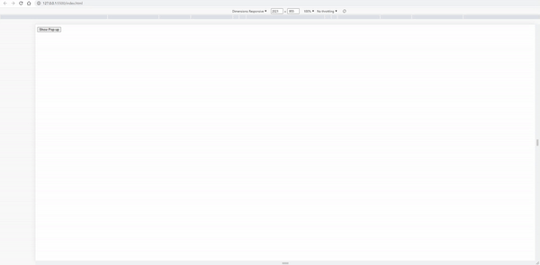

# SEA-ME.github.io

 -recent result- 
   

After complete all the SEA-ME projects, I have free times about 2 weeks in germany. 
I decided to publish guidlines of SEA-ME as an E-Book style. 
It will be on github pages. 
 
And this will be the record of developing E-Book. 
 
 
I'm currently doing personal project named  '<a href="https://github.com/jun-yub-kim/Newjeans_project">Newjeans_project</a>' 
 
I can also connect my project at here. 